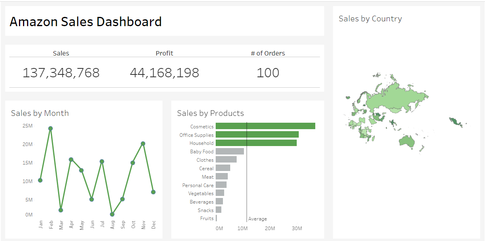

# Amazon Sales Data Analysis and Dashboard

This repository contains an exploratory data analysis (EDA) and visualization project of Amazon sales data. The goal is to uncover insights and present key metrics through a Tableau dashboard.

## Project Overview

The project includes the following steps:
1. **Data Cleaning and Preprocessing**: Handling missing values, data types correction, and feature engineering.
2. **Exploratory Data Analysis (EDA)**: Using Python to understand data distributions, relationships, and outliers.
3. **Visualization**: Creating a Tableau dashboard to represent key insights and metrics.

## Repository Structure

```
amazon-sales-analysis/
│
├── data/
│   ├── processed/
│ 
├── notebooks/
│   ├── EDA.ipynb
│
├── tableau/
│   ├── Amazon_Sales_Dashboard.twbx
|
├── images/
│   └── dashboard_screenshot.png
│
└── README.md
```

- **data/**: Contains the processed dataset.
- **notebooks/**: Jupyter notebooks used for data cleaning and exploratory data analysis.
- **tableau/**: Tableau workbook file containing the dashboard.
- **images/**: Screenshot of the Tableau dashboard.


## Tableau Dashboard

The Tableau dashboard provides the following insights:
- Sales distribution.
- Monthly sales trends.
- Geographic distribution of sales.
- Top-performing products.



## Contributing

Contributions are welcome! Please open an issue or submit a pull request for any improvements or bug fixes.

## License

This project is licensed under the MIT License. See the [LICENSE](LICENSE) file for details.

